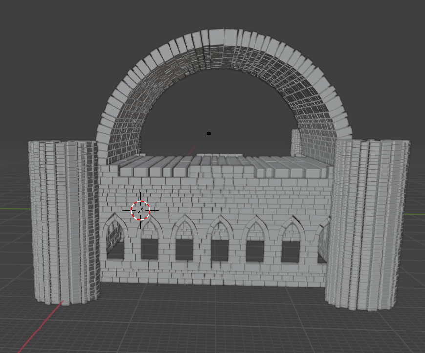

# GrandTheftAutoEcole

## Project Description

This is our final project for the **Introduction to Computer Graphics** course.  
We created an original 3D scene called **GrandTheftAutoecole**, where you can drive a car through a small city full of different elements.

Our scene was made using many of the concepts we learned in class, including:

- 3D modeling with triangles and basic shapes
- Texturing of buildings and objects
- Lighting with the Phong illumination model
- Node system for object hierarchy
- Animations
- Interactive camera and user input

---

## Features

### Modeling

- The **car** is modeled triangle by triangle using **VBOs and IBOs**, and it uses a **node system**:
  - The main car body is made of triangles.
  - The 4 wheels are cylinders attached as child nodes.
- **Buildings**:
  - Houses are made of a textured cube (walls *(many textures)*) and a colored pyramid (roof).
  - HLM buildings use one texture for the whole block.
- Other objects include:
  - A **football cage**
  - A **bench**
  - **Traffic lights** (a cylinder + 3 colored cubes)
  - **Road signs**
  - A **sun**
  - **Wind turbines** and **trees**

### Texturing

- Each house has a different texture.
- HLMs use one shared texture.
- The top of the car use one texture.
- The ground of the city uses one texture (roads) and the ground around the city uses an another texture (grass).
- Textures are loaded and applied using OpenGL.

### Lighting

- A directional light represents the **sun**, using the **Phong illumination model** taught in class.
- It includes ambient, diffuse, and specular lighting.

### Node System

Many objects use a parent-child node system:

- The **car** has a central body and 4 wheel children.
- The **house** combines a cube and a pyramid.
- The **traffic light** includes multiple shapes grouped together.
- The **wind turbines** combines 4 cylinders.

This helps us apply transformations more easily (scale, rotation, translation).

### Random Placement

- **Trees** and **wind turbines** are placed with **random positions** and **random scales**.
- This makes the environment more dynamic and less repetitive.

### Animation

- **Wind turbine blades** rotate continuously.
- **Traffic lights** change colors in a cycle (red → green → orange → red...).

### Camera System

- By default, the **camera follows the car from behind**.
- You can move the camera around the car using the **mouse**, while staying at the same distance.
- The camera cannot go below the ground.

### Controls

- **ZQSD**: Move the car
- **SHIFT**: Drive faster
- **Mouse**: Rotate the camera around the car
- **1–5 + P**: Change zoom level (P = farthest)

### Speedometer

- The total distance driven by the car is shown in the **window title** (since OpenGL doesn't support text directly).

### Blender Models

We created several 3D models using **Blender**, like more detailed versions of buildings and objects.  
However, we couldn't import them into the project because they had too many triangles for OpenGL in real-time.

<h4>Gallery</h4>

  
  

  
  

  
  

  
  

---

## How to Run the Project

### Requirements

- A C++ compiler with OpenGL support
- GLM and stb_image libraries
- GLFW and GLEW or glad

### Build Instructions

1. Clone the repository
2. Open with your favorite IDE or compile from terminal
3. Run the executable

**[Download the .exe here](#)**

---

## Demo Video

Watch the project in action on YouTube:  
**[https://youtube.com/](#)**

---